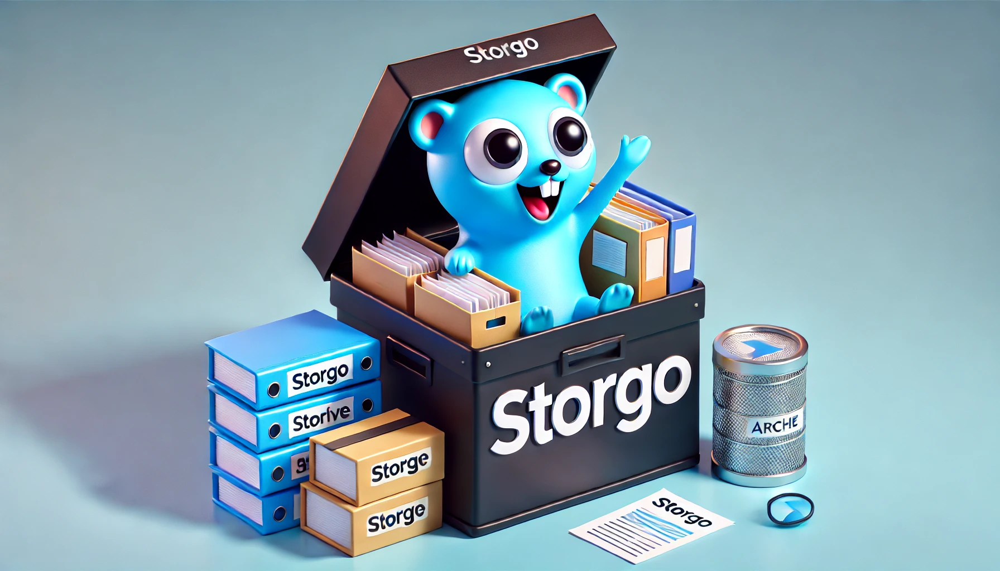

<!-- Improved compatibility of back to top link: See: https://github.com/othneildrew/Best-README-Template/pull/73 -->
<a id="readme-top"></a>

<!-- PROJECT LOGO -->
<br />
<div align="center">
  <a href="https://github.com/rafaelmgr12/storgo">
    
  </a>

  <h3 align="center">Storgo</h3>

  <p align="center">
    A fully distributed content-addressable file storage system built in Go.
    <br />
    <a href="https://github.com/rafaelmgr12/storgo/docs"><strong>Explore the docs »</strong></a>
    <br />
    <br />
    ·
    <a href="https://github.com/rafaelmgr12/storgo/issues">Report Bug</a>
    ·
    <a href="https://github.com/rafaelmgr12/storgo/issues">Request Feature</a>
  </p>
</div>

<!-- TABLE OF CONTENTS -->
<details>
  <summary>Table of Contents</summary>
  <ol>
    <li>
      <a href="#about-the-project">About The Project</a>
      <ul>
        <li><a href="#built-with">Built With</a></li>
      </ul>
    </li>
    <li>
      <a href="#getting-started">Getting Started</a>
      <ul>
        <li><a href="#prerequisites">Prerequisites</a></li>
        <li><a href="#installation">Installation</a></li>
      </ul>
    </li>
    <li><a href="#usage">Usage</a></li>
    <li><a href="#contributing">Contributing</a></li>
    <li><a href="#license">License</a></li>
    <li><a href="#contact">Contact</a></li>
  </ol>
</details>

<!-- ABOUT THE PROJECT -->
## About The Project

Storgo is a fully distributed content-addressable file storage system built with Go (Golang). It enables decentralized file storage and retrieval through peer-to-peer (P2P) communication, utilizing content-based addressing to ensure data integrity, redundancy, and efficient storage management. This system is designed to store files across distributed nodes, ensuring high availability and secure data transfers between peers.

<p align="right">(<a href="#readme-top">back to top</a>)</p>

### Built With

[![Go][Go-shield]][Go-url]

<p align="right">(<a href="#readme-top">back to top</a>)</p>

<!-- GETTING STARTED -->
## Getting Started

This is an example of how you may set up the project locally.

### Prerequisites

* Go (Golang)

```sh
go install
```

### Installation

1. Clone the repo

   ```sh
   git clone https://github.com/rafaelmgr12/storgo.git
   cd storgo
   ```

2. Install dependencies

   ```sh
   go mod download
   ```

<p align="right">(<a href="#readme-top">back to top</a>)</p>

<!-- USAGE -->
## Usage

### Running the Project

To run the project, execute the main file:

```bash
go run main.go
```

<p align="right">(<a href="#readme-top">back to top</a>)</p>

<!-- LICENSE -->
## License

Distributed under the MIT License. See `LICENSE.txt` for more information.

<p align="right">(<a href="#readme-top">back to top</a>)</p>

<!-- MARKDOWN LINKS & IMAGES -->
[Go-shield]: https://img.shields.io/badge/Go-00ADD8?style=for-the-badge&logo=go&logoColor=white
[Go-url]: https://go.dev/
